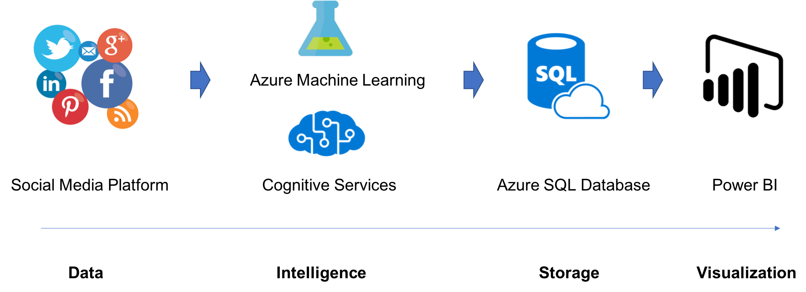

# Social Listening 
This repo is for Social Listening template.

## Solution Architecture
The Solution Architecture is quite easy for the social listening. All we need to follow is getting data, analyzing data (classification or sentimental analysis), data storing and data visualization to get insights and actions.

On Azure, we can use cognitive services - text analysis api to get sentimental analysis result (English or Chinese) or Language Understanding Intelligent Service (LUIS) to get the intents or classification via Natural Language Processing. To get more scalability and flexibility on the intelligence, we can also build self-designed machine learning or deep learning algorithms. In this tempalte, we built a Deep learning model to do classification and sentimental analysis for Chinese, based on biLSTM and Keras. After classification and sentimental analysis on the raw data from social media platform, we implied an Azure SQL Database to store the structured data. Finally, to get more insight from stored data, we created a dashboard with Power BI. Power BI can not only do data visualization but also do some intelligent jobs such as kmeans, abnormal detection, etc.

## Directory Structure
 * [SocialListening](.)
   * [code](./code)
     * [class_model](./code/class_model) Pretrained Classification Model
     * [segment](./code/segment) Downloaded chinese-char500.bin for training new DL model
     * [sentiment_model](./code/sentiment_model) Pretrained Sentiment Analysis Model
   * [data](./data) Some label2label and testing data
   * [img](./img) Markdown Images
   * [SQL](./SQL) SQL command
   * [template](./template) Sentiment Json-Format Info
   * [tool](./tool) Tools to connect Azure SQL DB
   * [DataKit.py](./DataKit.py) Main Function including: 
     * Getting data from social media platform (from MS agency)
     * Classification and Sentimental Analysis on comments
     * Storing into Azure SQL DB
   * [predict_comments_batch.py](./predict_comments_batch.py) Batch Prediction with Pretrained Classification and Sentimental Analysis Models
   * [predict_comments.py](./predict_comments.py) Prediction with Pretrained Classification and Sentimental Analysis Models
   * [requirements.txt](./requirements.txt)  
   * [SocialListening_DLTrain](https://github.com/davidyan0429/SocialListening_DLTrain) Training Template for classification and sentiment analysis.
